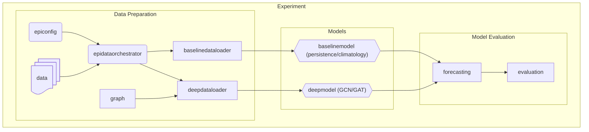

# GNN - based epidemiological - predictions
Systematic evaluation of graph structure choice in Graph Neural Network-based 
subnational epidemic forecasting. Companion codebase for [paper title].

## Project Structure

```
data/
notebooks/
src/
├── dataloading
│   ├── columnregistration
│   ├── dataloaders
│   │   ├── baselinedataloader
│   │   └── deepdataloader
│   ├── epiconfig
│   └── epidataorchestration
├── evaluation
├── experimenthandling
├── graphconstruction
├── models
│   ├── base
│   │   ├── basemodel
│   │   └── predictions
│   ├── baseline
│   │   ├── baselinemode.py
│   │   ├── climatology.py
│   │   └── persistence.py
│   ├── deep
│   │   ├── architectures
│   │   ├── deepmodel
│   │   └── strategies
│   └── utils.py
└── utils
    ├── colors.py
    ├── constants.py
    ├── exceptions.py
    ├── helpers.py
    ├── pathmanager.py
    ├── textformatting.py
    └── types.py
```

## Workflow
